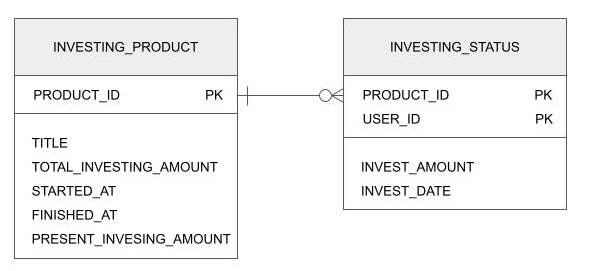

# Investment API

[](https://github.com/hyooi/InvestmentApi/actions/workflows/gradle.yml)
[](https://codecov.io/gh/hyooi/InvestmentApi)

---
부동산/신용 투자 서비스 RestAPI(*기본포트: 6549)

## 사용법

1. 앱 실행

```
 ./gradlew bootRun
```

2. API요청

- DataInitializer를 통해 기동 시 default상품을 입력하고 있어, 하기 api 바로 사용 가능

```
# 전체 투자상품 조회API
curl -X GET --location "http://localhost:6549/api/products"

# 투자하기API
curl -X POST --location "http://localhost:6549/api/invest/2/10000" -H "X-USER-ID: 1"

# 나의 투자상품 조회API
curl -X GET --location "http://localhost:6549/api/product" -H "X-USER-ID: 1"
```

3. H2접속

- URI: http://localhost:6549/h2
- JDBC Url: jdbc:h2:mem:kello
- User Name: sa

## 문제해결 전략 & 분석내용

### API

- Spring Jpa를 이용해 구현하되, 복잡한 SQL은 JPQL을 이용
- 결과값은 CommonResponse DTO로 래핑하여 리턴(결과코드, 결과값, 요청시간으로 구성)
- 에러 발생 시에는 ErrorResponse DTO로 래핑하여 리턴(에러코드, 에러메시지, 요청시간으로 구성)
- 모든 서비스는 하기 두 DB테이블을 조인하여 구현

### DB스키마



- 투자상품 테이블(INVESTING_PRODUCT): 투자 상품의 ID, 상품명, 총 투자 모집금액 및 투자 가능 기간 정보, 현재까지의 총 투자금액
- 투자상태 테이블(INVESTING_STATUS): 각 투자상품에 투자한 유저ID와 투자금액, 투자일시 정보
- 두 테이블은 일대다 관계
- 투자하기API는 REPEATABLE_READ를 통해 동시에 투자하여 총 투자 모집금액을 초과하는 것을 방지한다.

### 1. 전체 투자상품 조회API

- 요청

```
curl -X GET --location "http://localhost:6549/api/products"
```

- 응답
    - 정상 응답 시 정상응답코드(S00000)와 요청 시간, 결과를 리턴한다.
    - 결과는 **투자 상품의 ID, 상품명, 총 투자 모집금액, 투자 가능 기간 및 현재까지 투자된 총 금액, 투자자 수, 모집 상태**를 가진다.

```
{
    "resultCode":"S00000",
    "result":[
        {
            "productId":2,
            "title":"부동산 포트폴리오",
            "totalInvestingAmount":5000000,
            "startedAt":"2021-05-18T20:47:26.672289",
            "finishedAt":"2021-05-20T20:47:26.672289",
            "presentInvestingAmount":0,
            "investorCnt":0,
            "recruitingStatus":"RECRUITING"
        }
    ],
    "timestamp":"2021-05-19T20:48:21.7025012"}
```

### 2.투자하기API

- 요청

```
curl -X POST --location "http://localhost:6549/api/invest/2/10000" -H "X-USER-ID: 1"
```

- 응답
    - 정상 응답 시 정상응답코드(S00000)와 요청 시간, 결과를 리턴한다.
    - 결과는 투자한 **상품ID, 투자한 유저ID, 투자금액, 투자시각**을 가진다.
    - 실패 시 에러코드와 에러메시지, 에러 시간을 리턴하며, 에러코드는 ErrorCodeEnum의 정의를 따른다.

```
# 성공
{
    "resultCode":"S00000",
    "result":{
        "productId":2,
        "userId":1,
        "investAmount":10000,
        "investDate":"2021-05-19T20:50:05.5842207"
    },
    "timestamp":"2021-05-19T20:50:05.5892204"
}

# 실패 - SOLD OUT
{
    "errorCode":"E00001",
    "errorMessage":"SOLD OUT",
    "timestamp":"2021-05-19T20:54:52.5326933"
}
```

### 3. 나의 투자상품 조회API

- 요청

```
curl -X GET --location "http://localhost:6549/api/product" -H "X-USER-ID: 1"
```

- 응답
    - 정상 응답 시 정상응답코드(S00000)와 요청 시간, 결과를 리턴한다.
    - 결과는 **투자 상품의 ID, 상품명, 총 투자 모집금액, 나의 투자금액, 투자한 마지막 시간**을 가진다.

```
{
    "resultCode":"S00000",
    "result":[
        {
            "productId":2,
            "title":"부동산 포트폴리오",
            "totalInvestingAmount":5000000,
            "myInvestAmount":10000,
            "investDate":"2021-05-19T20:50:05.584221"
        }
    ]
    ,"timestamp":"2021-05-19T20:51:06.4172171"
}
```

### 기타

- in memory DB를 사용하고 있으므로, 실제로 다수의 서버 및 인스턴스로 동작할 시에는 별도의 DB에 붙여 기동해야 함

## 사용 기술

### Language

- Java11

### Framework / Library

- Spring Boot2
- JPA & Hibernate
- Junit5

### Database

- H2(in-memory)

### Etc

- Jacoco
- Lombok
- Gradle
- Github action